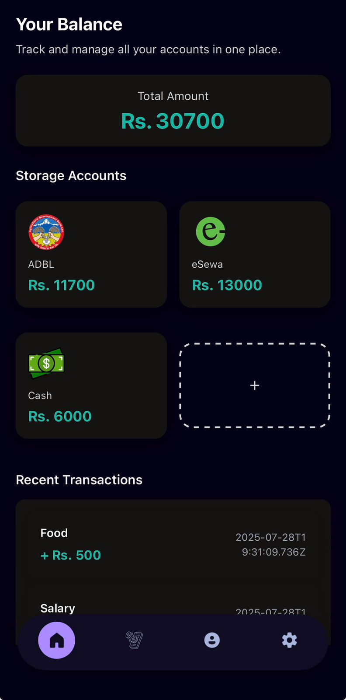
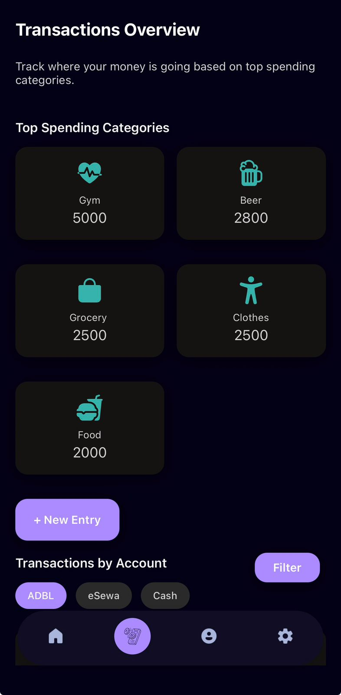
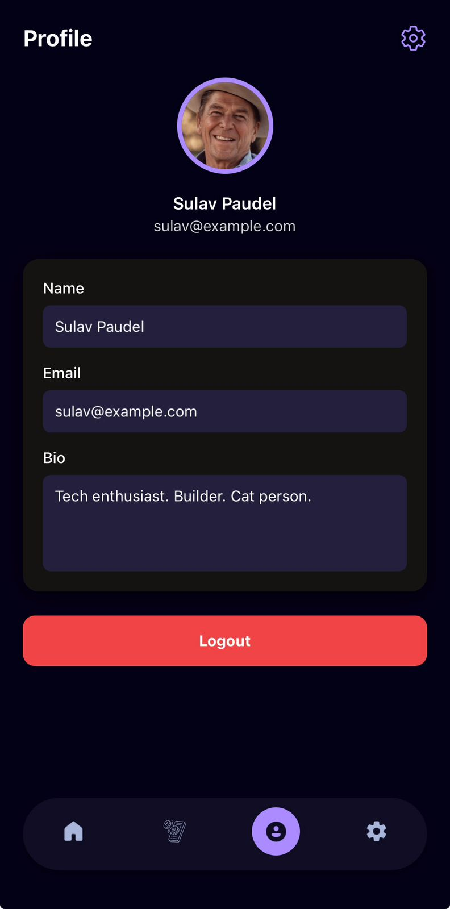

# 📊 Finance Tracker App

A privacy-first personal finance tracker built with React Native and Expo. Log and analyze your expenses from cash, bank, eSewa, and Khalti. It auto-detects transactions from your SMS and emails, categorizes them, and displays insights with interactive charts.

---

## ✨ Features

- 🔒 **Offline & Private** – All data is stored locally, nothing is sent to the cloud.
- 💰 **Multi-Source Tracking** – Track balances from:
  - Bank accounts
  - eSewa
  - Khalti
  - Cash
- 📥 **Auto Transaction Detection** – Parses SMS and Gmail for transactions (custom patterns).
- 📊 **Insightful Reports** – Categorized spending, filters, and graphical reports.
- 🛠️ **Built with**:  
  - React Native + Expo  
  - TypeScript + NativeWind  
  - SQLite (local storage)  
  - Gmail & SMS parsing

---

## 📸 Screenshots

Dashboard


Transaction


Profile

---

## 🚀 Getting Started

### 1. Clone the Repository

```bash
git clone https://github.com/itissulav/Finance-Tracker-App.git
cd Finance-Tracker-App
